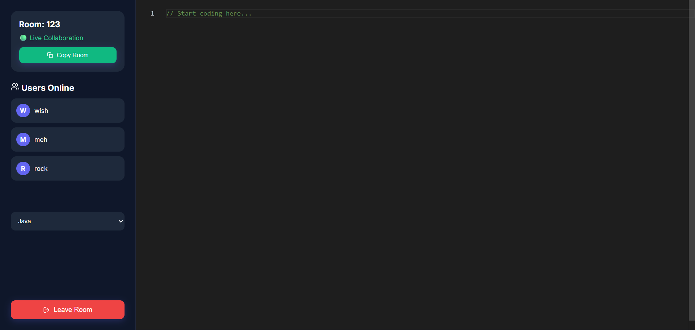

# Realtime Code Editor

A real-time collaborative code editor that enables multiple users to write and edit code together instantly.  
Built using modern web technologies and WebSocket communication, the platform allows seamless live coding through shared room IDs.

## Live Demo

🔗 Frontend (Vercel): https://realtime-code-editor-sepia.vercel.app/

🔗 GitHub Repository: https://github.com/sourodeep004/realtime-code-editor

## Features

- Real-time collaborative code editing  
- Unique room ID generation and sharing  
- Multi-user live synchronization using Socket.IO  
- Join/Create coding rooms  
- Live code updates without refresh  
- Syntax highlighting editor  
- Instant user collaboration  
- Responsive and clean UI  
- Fast and scalable deployment

Realtime collaborative editing and Socket.IO-based synchronization are standard features of this type of editor architecture. :contentReference[oaicite:0]{index=0}

## 🛠️ Tech Stack

### Frontend
- React.js
- Vite
- JavaScript
- CSS
- Socket.io Client

### Backend
- Node.js
- Express.js
- Socket.io

### Deployment
- Frontend: Vercel
- Backend: Render

Socket.IO and React + Node.js are commonly used for live collaborative editors. :contentReference[oaicite:1]{index=1}

## Project Structure

```bash
realtime-code-editor/
│
├── backend/
│   ├── node_modules/
│   ├── package.json
│   ├── package-lock.json
│   └── server.js
│
├── frontend/
│   ├── public/
│   ├── src/
│   │   ├── components/
│   │   ├── pages/
│   │   ├── App.js
│   │   └── index.js
│   ├── package.json
│   └── vite.config.js
│
├── Screenshots/
│
└── README.md
```

## Screenshots

### Home Page


### Coding Room

```

## Use Cases

- Pair Programming  
- Technical Interviews  
- Coding Practice  
- Team Collaboration  
- Remote Development Sessions  

## Deployment

### Frontend Deployment
- Hosted on **Vercel**

### Backend Deployment
- Hosted on **Render**

## Future Improvements

- Voice / Chat collaboration  
- Multi-language compiler  
- File management system  
- User authentication  
- Theme customization  
- Code execution support  

## Author

**Sourodeep Saha**  
GitHub: https://github.com/sourodeep004